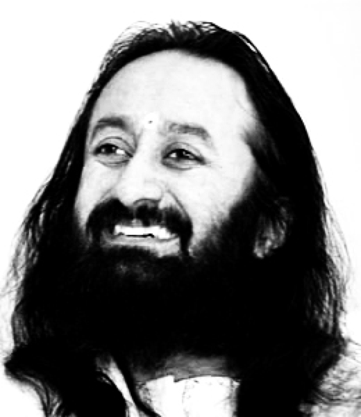

# Inception into Immaculate Contemplation of Cosmic Divine
 

### Art Of Living
My inception in to the cosmic divine has changed my ideologies of life,specially when "Art of Living" came across my way."Sri Sri"...The man with the scope to resurrect the human way of living with extracting the self consciousness from within (self of seer )and rejuvenating their lives.He stands as an inspiration to many by his deeds and ideologies.His knowledge of life and cosmos emerged from supreme consciousness is pure, immense and an ecstasy of joy

##### My contemplative realization (i.e..Learnings from primordial divinely consciousness  & Guru):

- The powerful weapon to unlock an aura of happiness, an ecstasy of spiritual joy,  lies with in the self… this self discovery  has been the quest of hinduism and has been the subject of vedanta and hindu scriptures.
- Life is not just what happens to us, it is a process to learn , understand  and unfold possibilities. i have learnt something which changed my understanding of life ..When in relationship .."_Love,faith & trust are beyond knowledge and don't ever analyze,test them as they are above knowledge_"…just give 100% love from your side..just as purely as you offer to god..all be back when it will be back…
- While being in relationship expectation is humanly… non expectation is godly which is extremely hard to achieve.
- Be Tied to your work and do it by enjoying with a vision of offering it to God, which will make you feel isolated from result.
- As the time passes with introspection having no thoughts and being existent but non living would confine to a meditative state.
