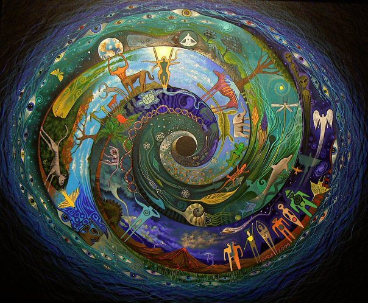

# Law of Karma

>Nature has chosen to gift life on earth.

Due to the specific capabilities of human race, man has grown to an intelligent animal on this planet.Understanding the nature, developing communication among humans by symbolic self expression , language for mutual communication were great insights for formation of complex social structures.These social interactions has established norms,rituals ,colonies and thus forming the human society.

Time being the variant of human transformation , human being has the choice of good or bad in every moment of  life.

Nature decides the existence of a system or organism by allowing it to undergo random transformation and finally obtain a  proper configuration which ensures stability(i.e when it attain a stable energy). Similarly human life is a phenomenal function resulting in karma energy. Nature enforces law of karma and keeps it a constant, as when you feed in positive energy its gives results in positive way similarly for the negative energy(natures law of conservation of energy ).

The profound play of dharma, on every one giving their turn to choose things either the good way or bad way finally accounts to their karma and is properly  balanced by the nature.
###### Karma cycle represented as mandala 

